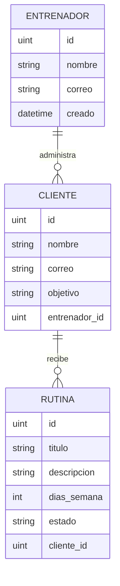
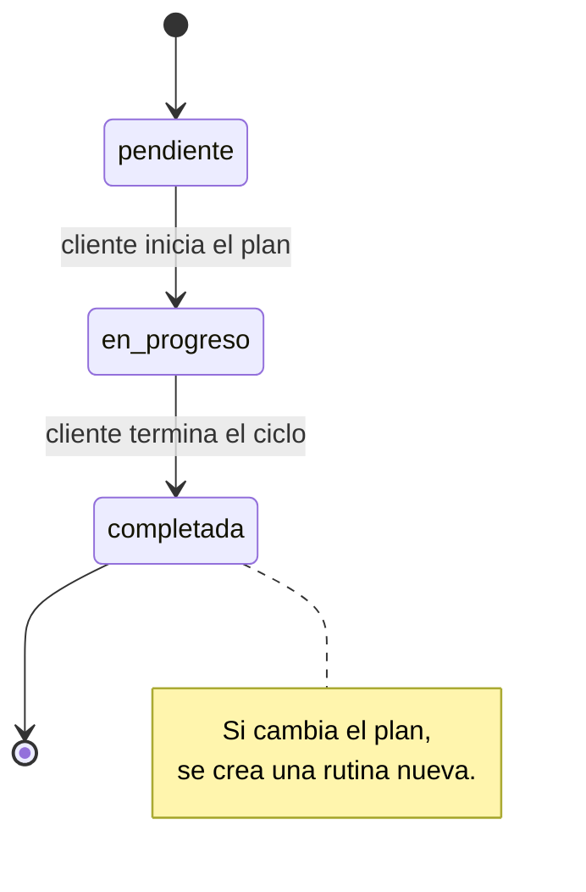

# Hito 1 · Ficha del negocio

**Pareja:** Capa Vargas Renato David · Burgos Macias Adrian Omar  
**Paralelo:** Aplicación para el Servidor Web A  
**Negocio en una línea:** GymCoach es una aplicación SaaS para que entrenadores personales de gimnasios organicen clientes, diseñen rutinas y sigan su progreso.

## 1. Negocio de referencia

ALTR Project es un SaaS creado por Aimee Tawhai para que gimnasios, coaches y entrenadores personales programen entrenamientos de CrossFit y acondicionamiento con menos trabajo manual que en hojas de cálculo. El producto ayuda a construir programas para clases y atletas; la entrevistada destaca que una versión posterior incorporó un panel de coaching rediseñado y una aplicación para clientes. La fuente indica que ALTR se utilizaba en 26 países y que la fundadora reportaba ingresos promedio de USD 7.000–8.000 al mes en el momento de la entrevista. Es una cifra publicada por la fundadora y reproducida por Starter Story, no un estado financiero auditado. El artículo presenta a ALTR como un SaaS, pero no informa el precio exacto ni la estructura de sus planes. Por eso usamos como referencia la venta recurrente de software especializado para entrenadores y gimnasios; para GymCoach proponemos una suscripción mensual por entrenador, con un límite de clientes por plan, que debe validarse con usuarios locales.

**Enlace:** [How I Launched A $7K/Month SaaS For Gyms — Starter Story](https://www.starterstory.com/how-to-launch-a-saas-for-gyms)

## 2. Caso de contraste

QuickCoach fue una plataforma B2B SaaS de gestión de clientes para entrenadores personales. Su fundador, Jonathan Goodman, publicó el cierre del producto y explicó sus resultados en The PTDC. Según su relato, el nivel gratuito resultó demasiado generoso y gran parte de los usuarios no pasó a un plan pagado: el producto generaba USD 11.000 de ingresos mensuales recurrentes de pago frente a USD 31.000 de gastos mensuales, una diferencia de USD 20.000 al mes. El fundador declaró haber perdido USD 1,4 millones y que decidió cerrar QuickCoach. La fuente también reconoce problemas de ejecución y compromiso del propietario; no atribuimos el cierre a una sola causa. Nuestra hipótesis de negocio es que un SaaS para entrenadores, un segmento con muchos profesionales de cartera pequeña, debe controlar el costo por cuenta y convertir a los usuarios gratuitos en clientes pagados. GymCoach limitará el costo del plan gratuito y validará antes el precio, la retención y cuántos clientes activos necesita cada entrenador.

**Fuente:** [I Just Lost $1.4 Million (Why QuickCoach Was Shut Down) — The PTDC](https://www.theptdc.com/articles/i-just-lost-1-4-million-why-quickcoach-was-shut-down)

## 3. Adaptación al Ecuador

1. **Cobro recurrente y acceso a pagos:** no todos los entrenadores independientes tienen tarjeta habilitada para pagos internacionales recurrentes. GymCoach debe ofrecer un plan mensual económico en USD y validar con los primeros usuarios opciones como transferencia o tarjeta mediante un proveedor disponible en Ecuador; no se presupone una pasarela concreta antes de confirmar sus condiciones.
2. **Facturación y tributación:** si se comercializa la suscripción, el negocio proveedor debe cumplir los requisitos de comprobantes electrónicos del SRI y confirmar el régimen tributario que le corresponde. El RISE ya no está vigente; RIMPE solo aplica a contribuyentes elegibles. GymCoach no reemplaza un sistema autorizado de facturación.
3. **Conectividad y equipos móviles:** el entrenador puede registrar una rutina desde el gimnasio y el cliente consultarla desde su teléfono. Por eso la aplicación debe ser adaptable a pantallas pequeñas, ligera y tolerante a conexiones inestables, evitando exigir equipos especializados o una conexión de escritorio.
4. **Privacidad de datos de bienestar:** objetivos, peso, lesiones y hábitos pueden revelar datos personales sensibles. El MVP solo necesita nombre, correo, objetivo general y rutinas; debe evitar almacenar diagnósticos o información médica y, antes de producción, aplicar consentimiento, acceso restringido y una política de retención conforme a la LOPDP.

**Qué cambió en el modelo por estas restricciones:** el primer plan se dirige al entrenador independiente y no a una cadena de gimnasios; se propone una tarifa mensual en USD con un límite simple de clientes activos. El modelo de datos mantiene el objetivo en texto general y excluye diagnósticos, peso y datos de salud del MVP.

**Referencias locales:** [Facturación electrónica — SRI](https://www.sri.gob.ec/facturacion-electronica) · [RIMPE — SRI](https://www.sri.gob.ec/rimpe) · [Ley Orgánica de Protección de Datos Personales — Gobierno de Ecuador](https://www.gob.ec/regulaciones/ley-organica-proteccion-datos-personales).

## 4. Modelo de datos

### Entidad: Entrenador

| Atributo | Tipo | Obligatorio | Ejemplo |
|----------|------|-------------|---------|
| ID | número entero | Sí | 3 |
| Nombre | texto | Sí | Diego Cedeño |
| Correo | texto | Sí | diego@example.ec |
| CreatedAt | fecha y hora | Sí | 2026-10-01T09:30:00Z |
| UpdatedAt | fecha y hora | Sí | 2026-10-01T09:30:00Z |

### Entidad: Cliente

| Atributo | Tipo | Obligatorio | Ejemplo |
|----------|------|-------------|---------|
| ID | número entero | Sí | 18 |
| Nombre | texto | Sí | Daniela Vera |
| Correo | texto | Sí | daniela@example.ec |
| Objetivo | texto | Sí | Mejorar fuerza general |
| EntrenadorID | referencia a Entrenador | Sí | 3 |
| CreatedAt | fecha y hora | Sí | 2026-10-01T09:30:00Z |
| UpdatedAt | fecha y hora | Sí | 2026-10-01T09:30:00Z |

### Entidad: Rutina

| Atributo | Tipo | Obligatorio | Ejemplo |
|----------|------|-------------|---------|
| ID | número entero | Sí | 42 |
| Titulo | texto | Sí | Fuerza inicial |
| Descripcion | texto | Sí | Cuerpo completo con cargas progresivas |
| DiasSemana | número entero | Sí | 3 |
| Estado | uno de: pendiente, en_progreso, completada | Sí | pendiente |
| ClienteID | referencia a Cliente | Sí | 18 |
| CreatedAt | fecha y hora | Sí | 2026-10-01T09:30:00Z |
| UpdatedAt | fecha y hora | Sí | 2026-10-01T09:30:00Z |

`ID`, `CreatedAt`, `UpdatedAt` y `DeletedAt` provienen de `BaseModel`. La eliminación de una rutina es lógica. En el MVP no se almacenan correo del cliente en respuestas de rutina, diagnósticos, peso ni historial médico.

### Relaciones

| Entidades | Cardinalidad | Frase |
|-----------|--------------|-------|
| Entrenador — Cliente | 1 a 0..N | Un entrenador administra cero o muchos clientes; cada cliente pertenece a un entrenador. |
| Cliente — Rutina | 1 a 0..N | Un cliente puede tener varias rutinas; cada rutina corresponde a un cliente. |

### Structs en Go

```go
type Entrenador struct {
    BaseModel
    Nombre   string    `json:"nombre" gorm:"not null"`
    Correo   string    `json:"correo" gorm:"uniqueIndex;not null"`
    Clientes []Cliente `json:"clientes,omitempty" gorm:"foreignKey:EntrenadorID"`
}

type Cliente struct {
    BaseModel
    Nombre       string   `json:"nombre" gorm:"not null"`
    Correo       string   `json:"correo" gorm:"uniqueIndex;not null"`
    Objetivo     string   `json:"objetivo" gorm:"not null"`
    EntrenadorID uint     `json:"entrenador_id" gorm:"not null"`
    Entrenador   Entrenador `json:"entrenador,omitempty" gorm:"foreignKey:EntrenadorID"`
    Rutinas      []Rutina `json:"rutinas,omitempty" gorm:"foreignKey:ClienteID"`
}

type Rutina struct {
    BaseModel
    Titulo      string  `json:"titulo" gorm:"not null"`
    Descripcion string  `json:"descripcion" gorm:"not null"`
    DiasSemana  int     `json:"dias_semana" gorm:"not null"`
    Estado      string  `json:"estado" gorm:"not null;default:pendiente"`
    ClienteID   uint    `json:"cliente_id" gorm:"not null"`
    Cliente     Cliente `json:"cliente,omitempty" gorm:"foreignKey:ClienteID"`
}
```

**Decisión de tipos que tuvimos que pensar:** `DiasSemana` es entero y se valida entre 1 y 7. `Estado` es una lista cerrada, no texto libre, porque cada cambio debe respetar el ciclo de la rutina. Una rutina apunta a un `Cliente`; el entrenador responsable se obtiene por la relación del cliente, evitando guardar y mantener dos referencias duplicadas.

### Diagrama del modelo completo



**Decisión discutible del modelo y por qué la tomamos:** ejercicios individuales no son todavía otra entidad: para el primer prototipo una rutina conserva descripción y días por semana. Se evita sobreconstruir el catálogo de ejercicios antes de validar cómo los entrenadores realmente programan sus planes.

## 5. Máquina de estados

**Entidad con estados:** Rutina.

| Estado | Qué significa |
|--------|---------------|
| pendiente | El entrenador creó la rutina, pero el ciclo aún no se ha iniciado. |
| en_progreso | El cliente comenzó a seguir el plan. |
| completada | El ciclo definido para la rutina terminó. |

| De | A | Quién la hace | Condición |
|----|---|---------------|-----------|
| pendiente | en_progreso | Cliente | El cliente comienza el plan asignado. |
| en_progreso | completada | Cliente | Termina el ciclo de la rutina. |

**Transición prohibida y por qué:** `pendiente → completada` no se permite porque el cliente no puede marcar como terminado un plan que nunca empezó. Una rutina completada no vuelve a pendiente; el entrenador crea una nueva versión para conservar el historial de trabajo.

### Diagrama de estados



## 6. Roles y permisos

En cada celda: no · sí · todos · solo los suyos.

| Acción | Entrenador | Cliente |
|--------|------------|---------|
| Ver lista de clientes y rutinas | Todos los suyos | No |
| Crear un perfil de cliente | Sí | No |
| Crear o editar una rutina | Sí | No |
| Eliminar una rutina | Sí | No |
| Ver rutina asignada | Todos los de su cartera | Solo las suyas |
| Iniciar o completar una rutina | No | Solo las suyas |
| Cambiar el entrenador responsable | No | No |

**Estado de implementación:** los roles y permisos definen el comportamiento esperado del producto, pero autenticación y autorización por usuario aún no están implementadas en el servidor. No se debe publicar la API ni cargar datos personales reales hasta añadir esos controles.

## 7. Mapa de endpoints por rol

| Endpoint | Rol que lo llama | Pantalla que lo consume | Qué devuelve | Qué valida | Código si falla |
|----------|------------------|-------------------------|--------------|------------|-----------------|
| `GET /clientes` | Entrenador | Panel de clientes; incluye sus rutinas | Clientes con entrenador y rutinas; acepta `?estado=` | Filtro de estado permitido | 422, 500 |
| `POST /clientes` | Entrenador | Alta de cliente | Cliente creado | Nombre, correo, objetivo y entrenador existentes | 400, 422, 500 |
| `POST /rutinas` | Entrenador | Crear rutina | Rutina nueva en `pendiente` | Título, descripción, días 1–7 y cliente existente | 400, 422, 500 |
| `GET /rutinas/{id}` | Entrenador o cliente propietario | Detalle de rutina | Rutina y cliente asignado | ID entero positivo y registro existente | 400, 404, 500 |
| `PUT /rutinas/{id}` | Entrenador edita; cliente cambia el estado propio | Editor/detalle de rutina | Rutina actualizada | Campos obligatorios, días 1–7 y transición permitida | 400, 404, 409, 422, 500 |
| `DELETE /rutinas/{id}` | Entrenador | Administración de rutinas | Confirmación de eliminación lógica | ID y registro existente | 400, 404, 500 |

La lista de rutinas de cada cliente se entrega como parte de `GET /clientes`, para que la vista principal pueda mostrar clientes y planes con una sola consulta lógica. La propiedad individual y los roles están especificados como contrato, pero requieren autenticación antes de filtrar datos por usuario.

### Matriz pantalla × endpoint

| Pantalla | `GET /clientes` | `POST /clientes` | `POST /rutinas` | `GET /rutinas/{id}` | `PUT /rutinas/{id}` | `DELETE /rutinas/{id}` |
|----------|:--------------:|:---------------:|:--------------:|:-------------------:|:-------------------:|:----------------------:|
| Panel de clientes | X |  |  |  |  |  |
| Alta de cliente |  | X |  |  |  |  |
| Crear rutina |  |  | X |  |  |  |
| Detalle de rutina |  |  |  | X | X |  |
| Gestión de rutinas |  |  |  | X | X | X |

**Endpoints implementados en código:** `internal/gymcoach/manejadores.go`. Los roles sirven como requisito del producto; las rutas todavía no aplican autorización.

## 8. Declaración de IA

Se usó GitHub Copilot en VS Code para revisar los materiales de las semanas 1–5, organizar este borrador del Hito 1, proponer redacción y apoyar la alineación del modelo GymCoach, endpoints y pruebas. La pareja debe validar las fuentes, las restricciones locales, el precio del plan y los permisos antes de entregar.
